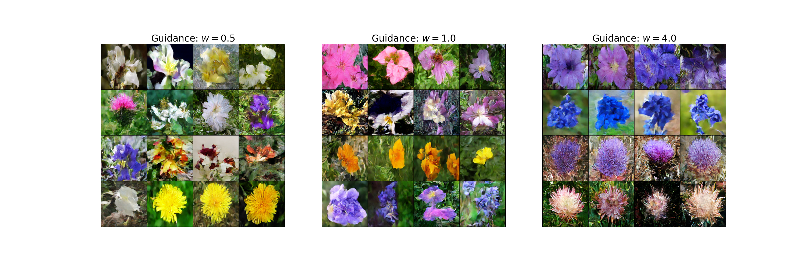

# **Flowers-102 Generation with DiT-Based Diffusion, Flow Matching, and SDE Models**

<figure>
  <p align="center">
    
  </p>
  <figcaption align="center"><b>Figure 1.</b> Samples generated by the Flow Matching DiT model on Flowers-102.</figcaption>
</figure>

### *An Academic-Style Project Description*

---

## **Abstract**

This repository provides a unified training framework for three modern generative modeling paradigms—**Denoising Diffusion Probabilistic Models (DDPM)**, **Flow Matching Models**, and **Score-based SDE Models**—built on top of a **Diffusion Transformer (DiT)** backbone.
Experiments are conducted on the **Flowers-102** dataset, with additional support for CIFAR-10 and MNIST.

The project aims to offer a clean, modular and research-oriented reference implementation covering:

* Fully discrete diffusion (DDPM)
* Continuous-time flow models (Flow Matching)
* SDE-based score models (VE/VP/Linear SDE formulations)
* DiT models for unified architectures across generative families

---

## **1. Repository Structure**

```
.
├── train_flower_ddpm.py
├── train_flower_flow.py
├── train_flower_sde.py
├── train_cifar_ddpm.py
├── train_cifar_flow.py
├── train_cifar_sde.py
│
├── models/
│   ├── ddpm_dit_model.py
│   ├── flow_dit_model.py
│   ├── sde_dit_model.py
│   └── __init__.py
│
├── diffusion/
│   ├── gaussian_diffusion.py
│   ├── diffusion_utils.py
│   ├── timestep_sampler.py
│   ├── respace.py
│   └── __init__.py
│
├── flow_utils/
│   ├── trainer.py
│   ├── simulator.py
│   ├── scheduler.py
│   ├── sampler.py
│   ├── path.py
│   ├── base.py
│   └── __init__.py
│
├── ckpts/
│   ├── autokl/
│   └── openai/
│
└── data/
    ├── flowers-102/
    ├── cifar-10-batches-py/
    └── MNIST/
```

---

## **2. Datasets**

### **Flowers-102 (Primary Dataset)**

Download and extract the dataset into:

```python
# data/flowers-102/
torchvision.datasets.Flowers102("data", download=True,)
```

### **CIFAR-10**

Use the standard Python pickled version:

```python
# data/cifar-10-batches-py/
torchvision.datasets.CIFAR10("data", download=True,)
```

### **MNIST**

Place raw MNIST files under:

```python
# data/MNIST/
torchvision.datasets.MNIST("data", download=True,)
```

Torchvision will automatically download missing files if allowed.

---

## **3. Pretrained Components (Checkpoints)**

The framework optionally uses pretrained components:

```
ckpts/
├── autokl/      # Pretrained autoencoder / KL-regularized VAE/tokenizer
└── openai/      # clip model for text embedding
```

Examples:

```
autokl: stabilityai/sd-vae-ft-ema
clip_model: openai/clip-vit-base-patch32
```

---

## **4. Models**

### **4.1 Diffusion Transformer (DiT) Backbone**

All three paradigms—DDPM, Flow Matching, and SDE—share a common transformer-based architecture inspired by **DiT**:

* Patch embedding of image tokens
* Transformer blocks with adaptive timestep conditioning
* Distributed attention blocks
* Final decoding projection to either noise, vector field, or score function

### **4.2 DDPM Model**

Defined in:

```
models/ddpm_dit_model.py
```

Implements:

* Forward noising process ( q(x_t | x_0) )
* Reverse denoising model ( \epsilon_\theta(x_t, t) )
* Standard and importance-weighted sampling

### **4.3 Flow Matching Model**

Located at:

```
models/flow_dit_model.py
```

Implements:

* Continuous-time path consistency
* Data → noise and noise → data ODE formulations
* Straight-line and optimal transport flow schedules
* Deterministic sampling (no SDE required)

### **4.4 Score-based SDE Model**

Located at:

```
models/sde_dit_model.py
```

Implements:

* VE / VP / subVP SDEs
* Score estimation via denoising score matching
* Sampling via predictor–corrector or ODE solvers

---

## **5. Training**

### **5.1 Flowers-102 — DDPM**

```bash
python train_flower_ddpm.py \
    --data-dir data/flowers-102 \
    --save-dir ckpts/flower_ddpm \
    --batch-size 64 \
    --epochs 200 \
    --device cuda
```

### **5.2 Flowers-102 — Flow Matching**

```bash
python train_flower_flow.py \
    --data-dir data/flowers-102 \
    --save-dir ckpts/flower_flow \
    --batch-size 64 \
    --epochs 200
```

### **5.3 Flowers-102 — SDE**

```bash
python train_flower_sde.py \
    --data-dir data/flowers-102 \
    --save-dir ckpts/flower_sde \
    --batch-size 32 \
    --epochs 300
```

---

## **6. Sampling**

Sampling utilities depend on the training script.
Typical invocation:

```bash
python sample.py \
    --ckpt ckpts/flower_ddpm/checkpoints/ckpt_latest.pt \
    --out samples/ \
    --n-samples 64
```

* DDPM uses reverse stochastic sampling or DDIM variants
* Flow Matching uses deterministic ODE integration
* SDE models use predictor–corrector or ODE-based sampling

---

## **7. Methodological Notes**

### **DDPM**

Uses discrete timesteps and Gaussian transitions:
[
q(x_t|x_0) = \mathcal{N}(\sqrt{\alpha_t}x_0,,(1-\alpha_t)I)
]

### **Flow Matching**

Learns a vector field:
[
v_\theta(x_t, t) \approx \frac{d}{dt} x_t
]
which exactly matches the probability flow ODE.

### **Score-based SDE Models**

Model the score function:
[
s_\theta(x_t, t) = \nabla_{x_t} \log p_t(x_t)
]

The SDE governs:
[
dx = f(x,t),dt + g(t),dW_t
]

---

## **8. References**

### **Flow Matching & Diffusion Tutorial (2025)**

```
@misc{flowsanddiffusions2025,
    author       = {Peter Holderrieth and Ezra Erives},
    title        = {Introduction to Flow Matching and Diffusion Models},
    year         = {2025},
    url          = {https://diffusion.csail.mit.edu/}
}
```

### **Diffusion Transformer (DiT)**

```
@article{Peebles2022DiT,
  title={Scalable Diffusion Models with Transformers},
  author={William Peebles and Saining Xie},
  journal={arXiv preprint arXiv:2212.09748},
  year={2022}
}
```

---

## **9. Acknowledgements**

This project draws inspiration from recent advances in flow matching, diffusion models, and DiT architectures.
We thank the authors of related open-source diffusion research, tutorials, and DiT implementations.